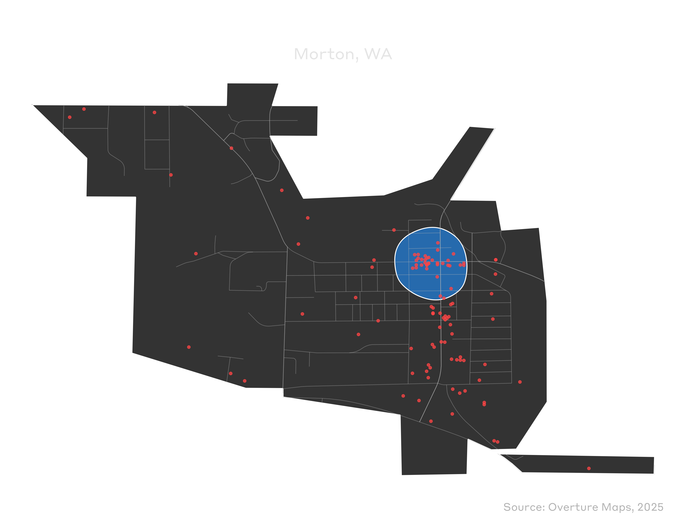

# Automated Downtown Delineation for Smaller U.S. Places

This repo demonstrates a reproducible method for delineating downtown/central business district polygons using historical population data and modern points-of-interest (POI) data. While the example focuses on Washington state, the approach is designed to work for any U.S. state—simply update the state code in the scripts (see [this example](plot/demo_dark2.png) for Wabash, IN).

The workflow has three main stages:

1.  Construct the **pre-auto town universe** (which cities/towns to include).
2.  Intersect that universe with **POI data** from vector tiles.
3.  Run a **kernel density–based** algorithm to delineate downtown polygons.

## Data sources

-   **Historical town/city populations (1790–2010)**\
    CSV files compiled from Wikipedia for each U.S. state, hosted in the [`Historical-Populations`](https://github.com/CreatingData/Historical-Populations) GitHub project (one CSV per state). These provide long-run population series for cities and towns.

-   **2020 decennial Census place populations and geometries**\
    Retrieved via the [`tidycensus`](https://github.com/walkerke/tidycensus) R package (`get_decennial()` with `geography = "place"`, `variables = "P1_001N"`, `state = "WA"`, `year = 2020`, `geometry = TRUE`). Used to get current population and place centroids for Washington cities and towns.

-   **County Rural–Urban Continuum Codes (RUCC)**\
    2023 [RUCC codes](https://www.ers.usda.gov/data-products/rural-urban-continuum-codes) from the USDA Economic Research Service, used to exclude central metropolitan counties (e.g., the counties containing Seattle and Spokane) so that the analysis focuses on small and mid-sized towns/cities whose downtowns are more comparable to one another.

-   **TIGER/Line cartographic boundary files**\
    County and place boundaries for Washington downloaded via the [`tigris`](https://github.com/walkerke/tigris) R package (`counties()` and `places()` with `cb = TRUE`). Used for town polygons and county overlays.

-   **POI vector tiles (Overture/Protomaps)**\
    The [Overture Maps Places](https://docs.overturemaps.org/guides/places/) tiles (`places.pmtiles`) served from an S3 bucket and extracted using the [`pmtiles`](https://pmtiles.io/#url=https%3A%2F%2Foverturemaps-tiles-us-west-2-beta.s3.amazonaws.com%2F2025-04-23%2Fplaces.pmtiles&map=6.38/47.293/-121.091) CLI to a WA-only GeoJSONL file. These features are then reprojected and intersected with the pre-auto towns to identify POIs inside each town.

## Universe definition (“pre-auto” towns)

The pre-auto town universe is constructed in the first script ([`01_universe.R`](code/01_universe.R)):

-   Start with **all Census places in Washington** with 2020 decennial population (`get_decennial()` for `geography = "place"`; `tidycensus`).\
-   Join places to the **historical population series** from the Wikipedia-derived CSVs by normalizing place names (e.g., removing “city”, “town”, “village” suffixes) and handling a few ad hoc name fixes (e.g., “Seattle” → “Seattle, Washington”).
-   Attach **RUCC codes** at the county level via place centroids intersected with counties and the USDA RUCC table.

A place is included in the pre-auto universe if it satisfies a set of criteria that closely follow the approach in my 2022 [*Cityscape* article](https://www.jstor.org/stable/48657957) on defining pre-automobile downtown business districts:

-   It has population ≥ 750 in at least one pre–World War II decennial year: 1900, 1910, 1920, 1930, or 1940.\
-   It is not in the most urban RUCC category (`rucc > 1`).\
-   Its 2020 population is between 500 and 150,000.

The output is an `sf` object of Washington places that meet these criteria, saved as a CSV with WKT geometry (`st_pre_auto_places.csv`).

## Scripts

### 01_universe.R

-   Reads historical population data from GitHub-hosted Wikipedia-derived CSVs and combines it with 2020 decennial Census place populations and geometries retrieved via `tidycensus::get_decennial()`.
-   Normalizes place names (removing "city", "town", "village" suffixes) to enable joins between the Census and historical datasets, with ad hoc fixes for naming inconsistencies (e.g., "Seattle" → "Seattle, Washington").
-   Attaches county-level RUCC codes by spatially intersecting place centroids with county boundaries.
-   Filters places to the pre-auto universe using the population and RUCC criteria described above.
-   Outputs `st_pre_auto_places.csv`, which contains place identifiers, cleaned names, 2020 population, RUCC codes, and polygon geometries stored as WKT in EPSG:6596 (NAD83(2011) / Washington North).

### 02_poi.R

-   Computes Washington's bounding box using `tigris::states()`, then calls the `pmtiles` CLI tool to extract places within that bbox from a remote `places.pmtiles` archive to a local GeoJSONL file (`places_washington.geojsonl`).
-   Reads the extracted POIs into `sf`, reprojects to EPSG:6596, and spatially intersects with the pre-auto place polygons from the previous step.
-   Assigns each POI to a specific pre-auto town and retains key POI attributes (ID, name, brand, categories).
-   Outputs `pre_auto_poi.csv` with geometries in WKT format (EPSG:4326) for downstream analysis.

### 03_downtown.R

-   Reads the CSV outputs from the previous two scripts and reconstructs `sf` objects for place polygons (`st_pre_auto_places.csv`) and POI points (`pre_auto_poi.csv`).
-   Defines a custom `downtown_kde()` function that processes each town by:
    -   Selecting the largest polygon component for multipart places.
    -   Intersecting POI points within that polygon.
    -   Running `hotspot_kde()` (from the [`sfhotspot`](https://github.com/mpjashby/sfhotspot) R package) on a hexagonal grid to compute KDE values.
    -   Filtering to high-density hexagons (top quartile via min-max scaling).
    -   Dissolving selected hexagons into contiguous blobs and computing blob-level metrics (mean z-score and hex count).
    -   Selecting the best blob via a composite score (hex count × mean z-score).
    -   Buffering and smoothing the selected blob to produce a final downtown polygon.
-   Applies the function iteratively to all pre-auto towns with error handling via `tryCatch()`.
-   Outputs `st_downtowns.geojson`, containing a downtown polygon for each successfully processed town.

## Example Map

The animation below shows the delineated downtown polygon for Morton, WA, visualized with the `mapgl` R package. Red points represent POIs used in the kernel density estimation, while the blue polygon marks the resulting downtown district boundary. This visualization provides a quick check of whether the automated delineation aligns with the town's actual commercial core.

