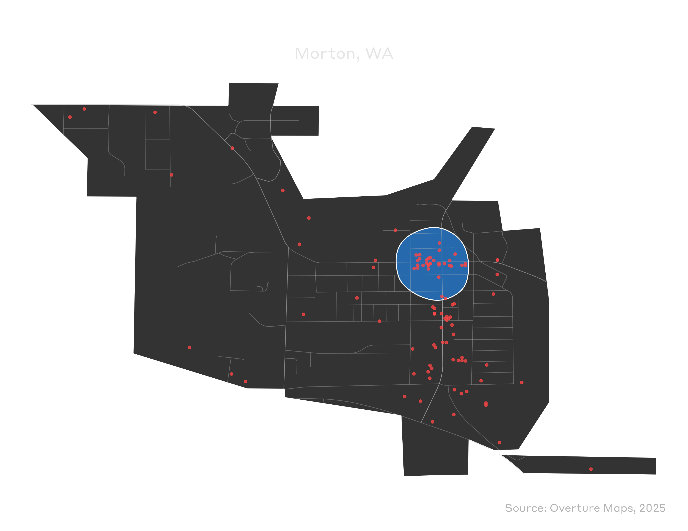

# Automated Downtown Delineation for U.S. Small and Mid-Sized Places

This repository provides a reproducible workflow for delineating downtown/central business district polygons for small and mid-sized U.S. cities and towns. The method identifies a national universe of pre-automobile-era places, collects modern points-of-interest (POI) data within each place's boundaries, and applies a kernel density–based algorithm to produce a downtown polygon. See [this example](plot/demo_dark2.png) for Wabash, IN.

The resulting dataset — approximately 6,500 downtown polygons spanning 47 states — is deposited at Harvard Dataverse: [https://doi.org/10.7910/DVN/RFXZ3F](https://doi.org/10.7910/DVN/RFXZ3F)

<p align="center">

</p>

The workflow has four scripts:

1. Build the **pre-auto town universe** — which cities and towns across the contiguous U.S. to include.
2. Collect **POI data** from Overture Maps vector tiles for a given state.
3. Run the **kernel density–based delineation** algorithm for a given state.
4. **Batch-run** scripts 2 and 3 for all 48 contiguous states.

---

## Data sources

- **Historical town/city populations (1790–2010)**
  Per-state CSV files compiled from Wikipedia, hosted in the [`Historical-Populations`](https://github.com/CreatingData/Historical-Populations) GitHub project. These provide long-run decennial population series for U.S. cities and towns.

- **2020 decennial Census place populations and geometries**
  Retrieved via [`tidycensus`](https://github.com/walkerke/tidycensus) (`get_decennial()`, `geography = "place"`, `variables = "P1_001N"`, `year = 2020`, `geometry = TRUE`). Used nationally to get 2020 populations and place boundary polygons.

- **USDA Rural–Urban Continuum Codes (RUCC, 2023)**
  County-level [RUCC codes](https://www.ers.usda.gov/data-products/rural-urban-continuum-codes) from the USDA Economic Research Service. Codes range from 1 (large metro core) to 9 (completely rural). Used in combination with OMB classifications to exclude core metropolitan counties.

- **OMB Core-Based Statistical Area delineation file (2023)**
  County-level Metro/Micro/Non-Core classifications and Central/Outlying county status from the [OMB delineation file](https://www.census.gov/programs-surveys/metro-micro/about/delineation-files.html). Combined with RUCC to allow outlying counties of large metros into the universe (e.g., a small town in a metro-adjacent county).

- **TIGER/Line cartographic boundary files**
  County and place boundaries downloaded via [`tigris`](https://github.com/walkerke/tigris). Used for spatial joins, place polygons, and bounding-box extraction.

- **POI vector tiles (Overture Maps)**
  The [Overture Maps Places](https://docs.overturemaps.org/guides/places/) dataset (`places.pmtiles`) extracted using the [`pmtiles`](https://pmtiles.io) CLI to a per-state GeoJSONL file. POIs are intersected with pre-auto town boundaries and flagged for institutional use (hospitals, college campuses, government buildings).

---

## Universe definition

The pre-auto town universe is defined in `01_universe_national.R` and applied to all 48 contiguous states. A place is included if it meets all of the following criteria, which closely follow the approach in [Van Leuven (2022)](https://www.jstor.org/stable/48657957):

- **Pre-automobile population:** Population ≥ 750 in at least one decennial year from 1900–1940, indicating a commercial core existed before car-dependent development.
- **Not a central metro county:** RUCC ≥ 2, or RUCC = 1 with Outlying (not Central) OMB designation. This admits small cities in metro-adjacent counties while excluding core suburbs.
- **2020 population:** Between 500 and 150,000. Excludes ghost towns and large cities where a different delineation approach is warranted.
- **Not a CDP** (with exceptions): Census Designated Places are excluded because they typically lack incorporated boundaries and pre-auto commercial structure. Exceptions are made for New England and several township-heavy states (CT, ME, MA, NH, RI, VT, NY, NJ, PA, MI, MN, WI) where CDPs often represent genuine historic town centers.

---

## Scripts

### `01_universe_national.R`

Builds the national pre-auto universe across all 48 contiguous states.

- Downloads 2020 decennial place populations nationally and county-level RUCC and OMB classifications.
- Reads per-state historical population CSVs from the `Historical-Populations` GitHub project, normalizes place names (stripping "city", "town", "village", etc. suffixes), and resolves ~100 known naming mismatches between Census and Wikipedia sources.
- Joins Census places to historical data, applies the pre-auto universe filter criteria, and attaches TIGER place polygon geometries.
- Outputs `data/national_pre_auto_places.csv` with place identifiers, names, state, 2020 population, county RUCC/OMB fields, and polygon geometry as WKT (EPSG:4326).

### `02_poi.R`

Collects and processes POI data for a single state (set `st_list`).

- Extracts POIs within the state's bounding box from the Overture Maps `places.pmtiles` archive using the `pmtiles` CLI. Output saved to `data/poi/raw/places_{state}.geojsonl`.
- Spatially intersects extracted POIs with the pre-auto place polygons to assign each POI to a town.
- Flags institutional POIs (college/university campus buildings, hospitals, government buildings) that should optionally be excluded from density calculations.
- Outputs `data/poi/clean/pre_auto_poi_{state}.csv` with POI attributes, town assignment, institutional flag, and WKT geometry (EPSG:4326).

### `03_downtown.R`

Delineates downtown polygons for a single state (set `st_list`).

- Loads pre-auto place polygons and POI points for the selected state. An `include_institutional` toggle controls whether institutional POIs contribute to density.
- Defines `downtown_kde()`, which for each place:
  - Selects the polygon part with the most POIs (handles multipart geometries robustly).
  - Runs `hotspot_kde()` ([`sfhotspot`](https://github.com/mpjashby/sfhotspot)) on a hexagonal grid.
  - Filters to the top-density hexagons (top 25% by min-max scaled KDE).
  - Dissolves hexagons into contiguous blobs, scores each blob by `kde_intensity × hex_count`, and selects the highest-scoring blob as the downtown core.
  - Buffers and smooths the polygon boundary.
- Applies `downtown_kde()` to all pre-auto places in the state with `tryCatch()` error handling.
- Outputs `data/polygons/downtowns_{state}.geojson` with fields: `city_fips`, `city_name`, `kde_intensity`, `downtown_score`.

### `04_run_all.R`

Batch-runs the POI extraction and downtown delineation for all 48 contiguous states. Skips states whose output files already exist, making it safe to restart after interruptions.

---

## File structure

```
data/
├── national_pre_auto_places.csv   # output of 01_universe_national.R
├── poi/
│   ├── raw/                       # per-state .geojsonl extracts from PMTiles (gitignored)
│   └── clean/                     # per-state POI CSVs with institutional flag
└── polygons/                      # per-state downtown polygon GeoJSONs
```

---

## Data deposit

The compiled dataset is publicly available at Harvard Dataverse (CC0 1.0):

> Van Leuven, Andrew, 2026, "Downtown Business District Polygons for Pre-Automobile-Era U.S. Cities and Towns", [https://doi.org/10.7910/DVN/RFXZ3F](https://doi.org/10.7910/DVN/RFXZ3F), Harvard Dataverse.

The deposit includes:

| File | Description |
|---|---|
| `downtowns_us.geojson` | National polygon file (~6,500 features, one per city) |
| `downtowns_by_state.zip` | Per-state GeoJSON files |
| `pre_auto_poi_us.csv` | National POI file used in density estimation |
| `poi_by_state.zip` | Per-state POI CSVs with institutional flag |
| `national_pre_auto_places.csv` | Pre-auto universe with place identifiers and WKT geometry |

---

## Output data dictionary

The primary output is `downtowns_us.geojson` (one polygon per city), with the following fields:

| Field | Description |
|---|---|
| `city_fips` | 7-digit Census place FIPS code |
| `city_name` | Place name with state suffix and Census type suffixes ("city", "town") removed |
| `state` | Two-letter state abbreviation |
| `kde_intensity` | Mean KDE z-score across the hexagonal grid cells that make up the selected downtown blob. Higher values indicate a more concentrated cluster of POI activity relative to the rest of the place. |
| `downtown_score` | `kde_intensity` × number of hexagons in the blob. This composite metric was used to select the primary downtown blob when multiple candidate clusters existed; it is retained for reproducibility and can be used as a rough index of downtown commercial density. |

---

## Example

The animation below shows the delineated downtown polygon for Morton, WA. Red points are POIs used in the kernel density estimation; the blue polygon is the resulting downtown district boundary.

<p align="center">

</p>
